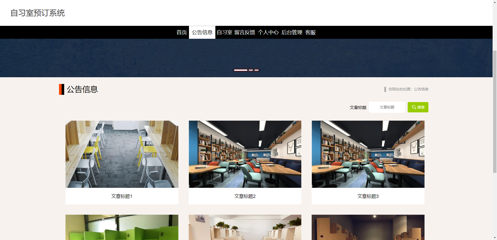
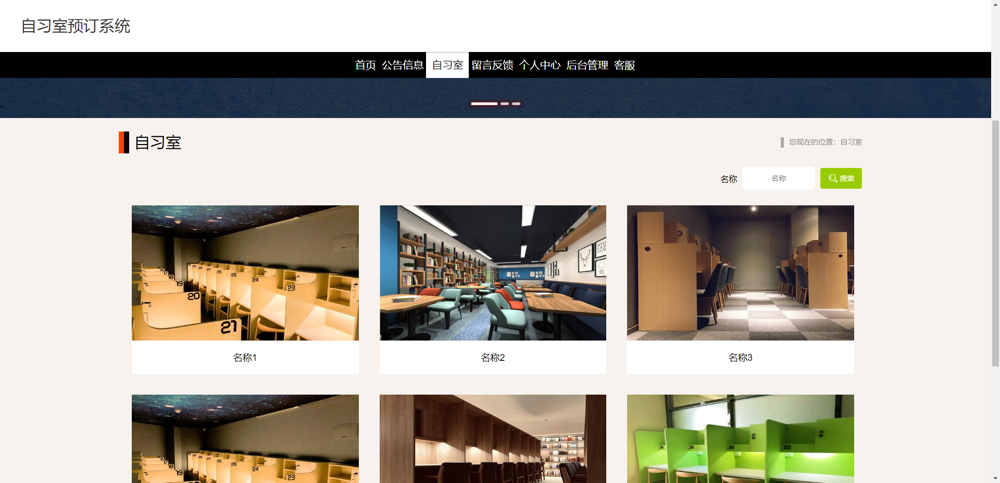
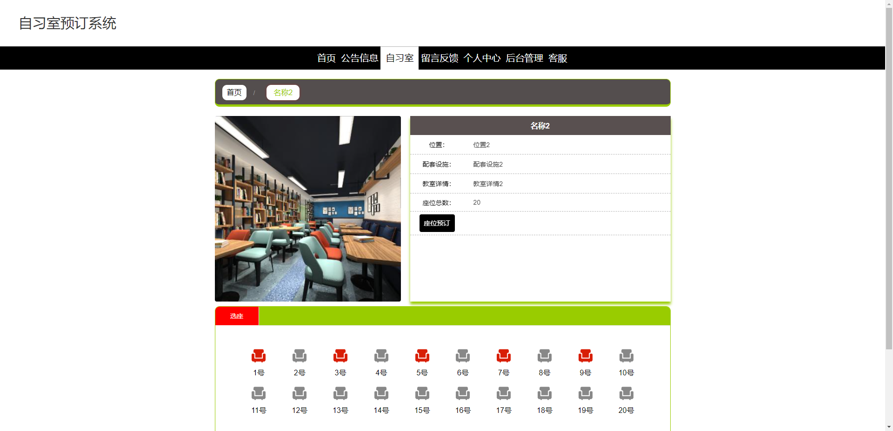
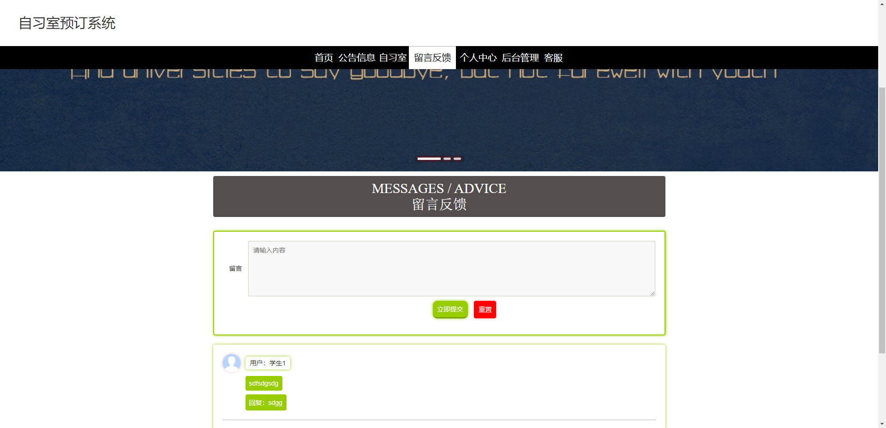
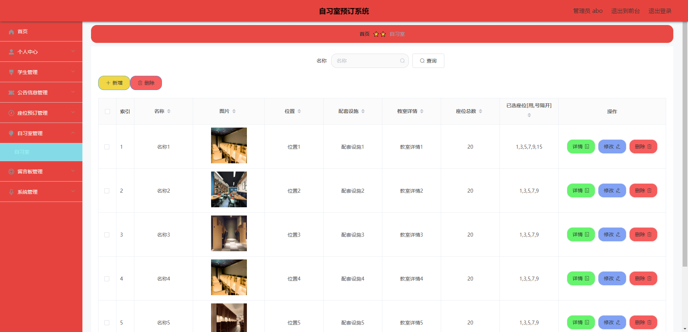
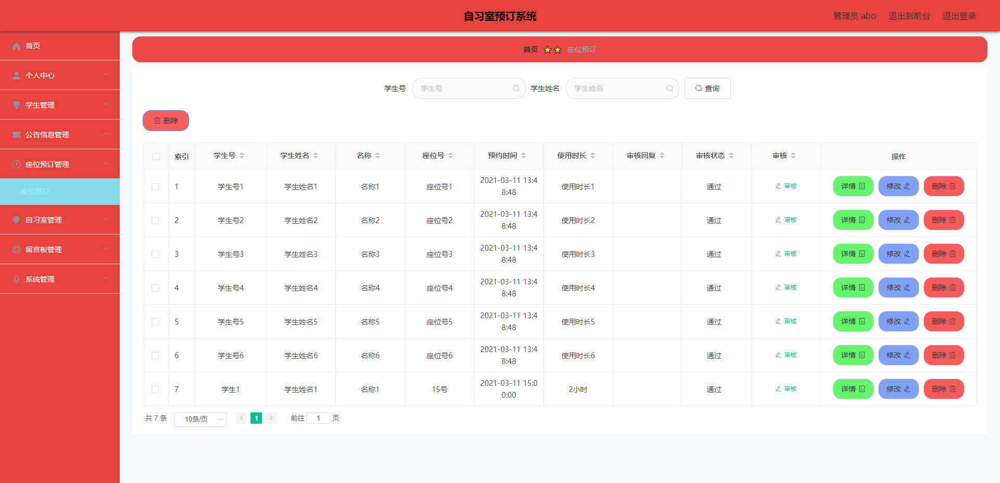
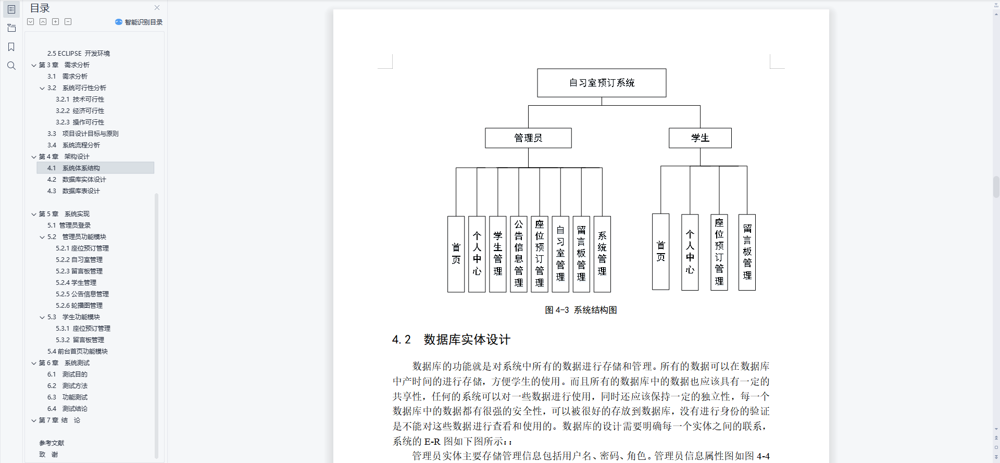
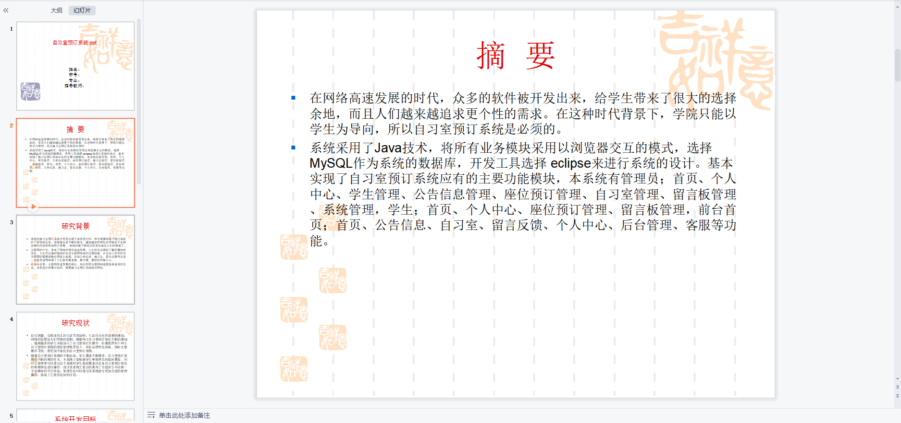
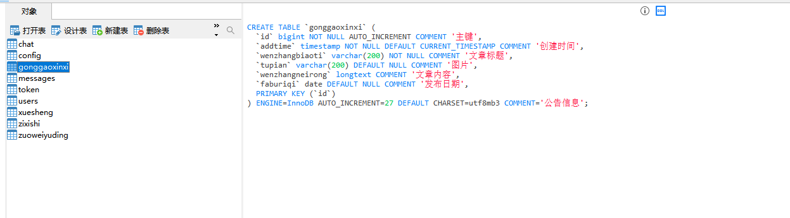

# 1 项目介绍
基于SSM+Vue的自习室预约系统：后端 SpringBoot、Mybatis-Plus，前端Vue+ElementUI，具体功能如下：
## 管理端
- 个人中心：查看和修改个人信息、修改密码
- 学生管理
- 座位预定管理
- 公告管理
- 自习室管理
- 留言板管理
- 系统管理(客服管理、轮播图管理)
## 用户端
- 个人中心：查看和修改个人信息、修改密码
- 座位预定管理
- 留言板管理
- 前台功能(查看公告、查看自习室、座位预定等)
# 2 系统运行截图
## 2.1 用户登录

## 2.2 公告信息

## 2.3 查看自习室

## 2.4 自习室详情

## 2.5 留言反馈

## 2.6 自习室管理

## 2.7 预约管理

## 2.8 万字文档

## 2.9 ppt

# 3 数据库设计

# 4 源码数据库获取(收费)

